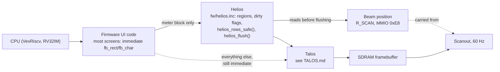

# Helios — the UI controller / graphics library

Helios is the UI layer built on top of [Talos](TALOS.md), the 2D draw engine. This page is the dedicated
reference; `docs/HELIOS_SPEC.md` is the full design document and build log this page summarises — read it
for the prior-art research (Amiga Copper/blitter, PS1 Ordering Tables, LVGL, u8g2, MiSTer OSD) and the
complete reasoning behind each decision below.

## What it is

Today's firmware draws the UI by calling `fb_rect()`/`fb_char()`/etc. immediately, at the moment a screen
decides something changed. Helios replaces that with a small, fixed-size **display-list-style layer**: named
screen regions (the meter box, the art panel, a list row, …) register themselves once, mark themselves dirty
when their content changes, and a single flush point in the main loop drains whatever is dirty into real
Talos commands — timed against the video beam instead of firing the instant the CPU decides to draw
(`docs/HELIOS_SPEC.md` sections 4 and 9).

It deliberately does **not** attempt a general retained scene graph with automatic diffing (the
React/LVGL-full-widget-tree model) — there is no spare CPU or SDRAM bandwidth for a diff pass on this
core, and this project has spent its whole draw-engine history fighting for every draw-command reduction it
can get. Tau's UI is a handful of named, fixed regions per screen, not a general widget tree, so Helios can
skip the general rectangle-merge algorithm LVGL needs and give each region its own single dirty flag instead
(`docs/HELIOS_SPEC.md` section 4).

## Why frame synchronization is the actual problem

`docs/PHASE_F_SPEC.md` section 15 (B-232) traced reported UI tearing to a real structural gap: Talos's video
timing block already pipelines scanout *reads* one row ahead (`do_fill`/`fill_line_req`/`linebuf`), isolating
pixel fetch from live SDRAM latency — but provides **zero protection for CPU writes**. A multi-transaction UI
update can have its top rows already scanned (old content) while the CPU is still writing lower rows (new
content). Two already-existing hooks were found unused: a dead `vblank` input pin at `core_top.v`, and an
internally-generated `vs_pulse` in the same clock domain as scanout itself.

## "Racing the beam" — why a vblank pulse alone isn't enough

The first, obvious idea — gate drawing on a vblank pulse — turned out not to work on its own. The pulse is
only about **167 microseconds** wide, and the whole vertical blanking interval is about **1.7 ms**, against
**tens of milliseconds** for a full screen repaint (`docs/AUDIT_TRAIL.md` B-267). A firmware poll checking a
pulse bit will almost always miss it, and even if it caught every pulse, one 167 us window per 16.7 ms frame
is nowhere near enough time to flush a real repaint.

So H1 uses the scanning beam's **live position** instead of waiting for a pulse: the video line counter is
carried into the CPU's clock domain (`R_SCAN`, MMIO 0xE8, macro `TAU_BEAM`), and a draw is let through when
one of three conditions holds — the beam is currently in blanking, the beam has already passed the region
(so it will show correctly next frame), or the beam is far enough behind the region that Talos, which draws
roughly **8x faster** than the beam scans, will finish before the beam catches up (`helios_rows_safe()`,
`fw/helios.inc`). This rule was verified exhaustively on the host against an independent model —
`sim/test_helios_beam.py`, 837,600 cases (`docs/AUDIT_TRAIL.md` B-267).

## The phased build

`docs/HELIOS_SPEC.md` section 9 lays this out as H0/H1/H2; status below is current as of this pass.

| Phase | What it is | Status |
|---|---|---|
| **H0** | CDC the vblank/frame-position signal into `clk_sys`, expose as MMIO. Started as a single vblank bit (0xD0), then a free-running frame counter (`tau_vs_counter.sv`, B-260) once polling a 167 us pulse proved unworkable. | **Hardware-confirmed.** The frame counter reads about 60/S on real hardware (B-266, alpha.16). |
| **H1** | The beam-position mechanism above (`tau_cdc_gray_bus.sv`, `R_SCAN`, `helios_rows_safe()`), plus the display-list core itself (`fw/helios.inc`: region registration, `helios_mark_dirty()`, `helios_flush()`). First adopter: the meter block in `ui_draw_dynamic_cold` (rows 126-259), which waits instead of drawing across the beam. | **Hardware-confirmed for the meter block.** Info > BEAM reads `OK 30% WAITED` on alpha.34 (`docs/ROADMAP.md`, `docs/AUDIT_TRAIL.md` B-267). |
| **H2** | True double buffering: two SDRAM framebuffer regions, the CPU always writes to whichever one scanout is *not* currently reading, and a vblank-gated register flip swaps which region scanout reads next frame — a pointer swap, not a pixel copy (the Amiga finding, `HELIOS_SPEC.md` section 5). | **Built and simulation-verified 2026-09-27 (B-340); not yet fit or on hardware.** H0/H1 being hardware-confirmed meets this phase's own stated precondition ("once H0/H1 are built and measured"). |

### What H2 actually adds, precisely (B-340)

Two new MMIO registers, `DBUF_CPU` (0x118) and `DBUF_DISP` (0x11C, `docs/MMIO_ALLOCATION.md`), behind a new
macro `TAU_DBUF` independent of `TAU_BLIT`. A few details worth stating precisely because they resolve real
ambiguity in the original design sketch:

- **The CPU write-side buffer select is independent of the displayed buffer, not automatically its
  opposite.** They have to be independent, because H1's own incremental beam-gated draws (the meter block)
  still target a single buffer directly — whichever one is currently displayed — and must keep doing so.
  Only a genuine full-frame redraw (the chrome, opening a menu) sets the CPU-side selector to the *other*
  buffer for the duration of that redraw, then requests a flip.
- **The buffer-1 offset (1,048,576 words / 2 MiB above buffer 0) applies only to addresses below
  `DBUF_VISIBLE_WORDS` (184,320 words, i.e. the 400x360 visible frame).** Every off-screen stash region this
  project already has packed just above row 360 — the art panel, meter thumbnails, the Chladni plane, the
  TIM1 cover-index plane, every diagnostic probe cell — is reached through the same plain `FB_BASE`-relative
  addressing as ordinary on-screen draws. An unconditional offset would have silently corrupted every one of
  those regions the moment a redraw set the CPU-side selector.
- **Blit-mode opcodes (`OP_BLIT`/`OP_BAR`/`OP_SBLIT`/`OP_CBLIT`/`OP_RRECT`) are untouched by any of this** —
  they already address through Talos's own firmware-programmable sticky base fields, so a caller wanting one
  of them to target the back buffer sets that base itself.
- `DBUF_ENABLE=0` (every bitstream before this one) is a proven byte-for-byte no-op, checked in simulation
  with the flip/select ports actively driven, not just left untouched (`sim/tb_helios_dbuf.v`,
  `make test-rtl-helios-dbuf`).

## What's NOT yet converted, and why that matters

**The full-screen chrome redraw (`ui_draw_chrome`) is still registered immediate — `y1=0xFFFF`, no beam
gating (`docs/ROADMAP.md` item 7).** This is exactly why H2 exists: a full repaint is too big to fit inside
the beam's safe windows the way a small meter update can, so gating it row-by-row the way the meter block is
gated would just make it stutter instead of tear. It needs the other buffer to draw into while the current
one is still being shown, i.e. real double buffering, not finer-grained row gating. Converting
`ui_draw_chrome` to use the back buffer, and building the `DBUF_READY()`-style capability probe that would
let it do so safely on older bitstreams, are the concrete next steps once H2 has a Quartus fit
(`docs/HELIOS_SPEC.md` section 5's own "not done" list).

`fb_round_rect_on()` (used for nearly every panel and selected list row in the UI) was converted to Talos's
`OP_RRECT` behind an `RRECT_READY()` probe as part of H1 (`docs/HELIOS_SPEC.md` sections 2 and 10) — this is
a Talos-opcode conversion, not itself beam-gating, but it is the first real adopter of the "coalesce onto one
hardware command" discipline Helios's architecture is built around.

## Typography, icons and theming (design only)

`docs/HELIOS_SPEC.md` sections 7.1-7.4 cover three related, design-only areas that extend Helios rather than
change its core mechanism — none of this is built:

- **Loadable fonts (7.1).** Today's "scaled" text rides `OP_SBLIT`'s Bresenham stepping, which is genuinely
  crisp at integer factors (2x, 3x) but not at 1.5x — a real, previously-uncosted gap. The design response is
  that a loaded font never scales at runtime: each supported size is its own pre-rendered, offline-rasterized
  atlas (same shape as the existing `font_rom.v` + `tools/gen_font_rom.py` pipeline), with the built-in ROM
  font staying resident as a guaranteed fallback.
- **Icons (7.2).** Not on-device SVG rasterization (a large, float-heavy piece of code this FPU-less core has
  no business running while also decoding audio) — instead a specialization of the already-proven
  meter-thumbnail pipeline (offline rasterize, quantize to a small palette, RLE-encode, decode once at first
  use). B9's palette re-index is called out as directly useful here: one base icon bitmap plus a per-theme
  palette swap covers theming, instead of a separate bitmap per theme per icon.
- **Theming via CLUT-from-roles (7.4).** The framebuffer is true-colour RGB565 throughout; the CLUT is a
  separate 256-entry lookup used only for `OP_CBLIT` source bitmaps (a "sprite palette," not an indexed
  display mode). A Figma colour-variable export is judged plausible and is the same offline-conversion shape
  as fonts/icons, with two real costs flagged honestly: RGB565 quantization is lossy and needs to be
  reported, not silently rounded, and the text anti-aliasing gamma table is fitted to the *current* palette
  and needs re-verification (`tools/gen_text_gamma.py --check`) whenever the palette changes materially. This
  is the same mechanism the project's shipped theme system (role table, `tau-assets.bin`, `docs/THEME_SPEC.md`)
  already uses for colour; Helios's own contribution is making sure drawing through it stays cheap.

## Roadmap / outlook

| Item | Status | Concrete next step |
|---|---|---|
| **H2 firmware integration** | RTL built and sim-verified (B-340); no Quartus fit, no firmware, no hardware yet | A `DBUF_READY()`-style probe (matching `BLIT_READY()`/`RRECT_READY()`'s precedent) and `ui_draw_chrome` actually using the back buffer are the named next steps (`docs/HELIOS_SPEC.md` section 5). |
| **More regions converted to beam-gated drawing** | Only the meter block is converted | `docs/ROADMAP.md` item 7 names progress/clock/transport rows and toasts as the next adopters (`docs/HELIOS_SPEC.md` section 9). |
| **Now-playing screen redesign** | Explicitly parked for its own session | Recommended to happen *after* the theme-role work so it is written against roles, not fixed colours (`docs/ROADMAP.md` item 7). |
| **Loadable fonts / icons / Figma theme export** | Design-only (sections 7.1-7.4) | Each needs its own format + verification pass; recorded as worth doing once Helios's own font format ships at least one real font (`docs/HELIOS_SPEC.md` section 7.3). |
| **UI/audio decoupling via real concurrency** | Considered and declined | No interrupt controller exists anywhere in this design, and the audio-never-glitches guarantee is this project's one truly protected invariant — a scheduler or interrupt path that is even slightly wrong under load is judged strictly worse than today's cooperative model. The bounded vblank/beam-gated flush already gets most of the real benefit for free. Revisit only if real, decode-stall-specific UI unresponsiveness is observed after the flush model ships (`docs/HELIOS_SPEC.md` section 8). |

## How Helios fits into the whole system

## See also

- [TALOS.md](TALOS.md) — the draw engine Helios is built on.
- `docs/HELIOS_SPEC.md` — the full design document (prior-art research, sections 5-8, 10-11).
- `docs/PHASE_F_SPEC.md` section 15 — the original tearing investigation this document's design supersedes.
- `docs/MMIO_ALLOCATION.md` — register addresses for `VBLANK`, `SCAN`, `DBUF_CPU`, `DBUF_DISP`.
- `docs/THEME_SPEC.md` — the theme-role system Helios's CLUT-from-roles design builds on.
