# Talos — the 2D draw engine

Talos is the name for the hardware block that used to be described in these docs only as "the blit engine"
or "`mp3_fb.sv`'s draw engine." This page is the dedicated reference; `docs/PHASE_F_SPEC.md` section 5 is
the full build log this page summarises, and `docs/MMIO_ALLOCATION.md` is ground truth for every register
address quoted below.

## What it is

Talos is a single-command-queue blitter coprocessor: one shared SDRAM port that also serves video scanout,
commands execute strictly serially (no parallelism, no concurrent draws), single-buffered until Helios's H2
work lands (see [HELIOS.md](HELIOS.md)). Structurally it is closest in spirit to the **Amiga blitter**, not
to a modern GPU — a fixed set of rectangle/copy/fill primitives driven by a small set of sticky configuration
registers plus a per-command FIFO word, not a shader pipeline or a scene graph (`docs/HELIOS_SPEC.md` section
1). The CPU is an RV32IM softcore with no float unit, decoding MP3/FLAC in the same superloop that drives the
UI, and there is no interrupt controller anywhere in this design (`HELIOS_SPEC.md` section 1) — everything is
cooperative and polling.

## Why it exists

The firmware's own comments record that drawing pixel-by-pixel from the CPU was measured causing audible
audio jitter (`docs/TECHNICAL_SPEC.md` section 3). Talos exists to move that work into hardware, decomposing
every draw into single-burst units so a pending scanline fill (which always wins arbitration) waits at most
one burst — about 500 cycles against roughly 4,167 cycles of per-scanline slack (`PHASE_F_SPEC.md` section 5).
`OP_COPY` was already load-bearing for three separate jobs in software before Talos existed — the cover-art
slide panel, the waterfall meter scroll, and an off-screen gradient stash used to erase cheaply — so
generalising it into a real blit engine was "already proven in software," per the spec's own framing.

## Opcode table

Source: `src/fpga/core/mp3_fb.sv` opcode localparams and header comments, `docs/TECHNICAL_SPEC.md` section 3,
`docs/PHASE_F_SPEC.md` section 5.

| Opcode | Name | What it does | Built |
|---|---|---|---|
| 0 | `OP_RUN` | Fill a horizontal run of one colour | Original engine |
| 1 | `OP_RECT` | Fill a w x h block | Original engine |
| 2 | `OP_CHAR` | One anti-aliased scaled glyph (Inter, 16x16 cell, 4-bit coverage, Bresenham 1x/1.5x/2x/3x) | Original engine |
| 3 | `OP_COPY` | Raw SDRAM-to-SDRAM copy (row-buffer limit applies, see below) | Original engine |
| 4 | `OP_BLIT` (B1) | Generalised copy — independent source/destination base and stride, so it can reach any two rectangles in SDRAM, not just the framebuffer; optional colour-key transparency (B2) and alpha blend (B5) | B-103/B-104 |
| 5 | `OP_BAR` (B6) | Meter column primitive: `(x, base_y, height, lit, unlit)` as two chained fill bursts, replacing ~72 `fb_rect` calls per frame on the hottest per-frame path | B-104 |
| 6 | `OP_SBLIT` (B4) | Scaled blit, nearest-neighbour (Bresenham/DDA stepping), one SDRAM read per output pixel | B-105 |
| 7 | `OP_CBLIT` (B8) | Palette blit: an 8-bit index plane expanded through the 256-entry CLUT, plus a sticky re-index offset (B9) | B-148/B-179 |
| 8 | `OP_RRECT` (B11) | Rounded rectangle from a 16-entry corner-cut lookup table, replacing `fb_round_rect_on`'s up-to-33-command software corner search | B-205 |

`cmd_op` is 4 bits wide (widened from 3 to fit `OP_RRECT`, `PHASE_F_SPEC.md` section 5's B11 note). An
unrecognised or truncated opcode on an older bitstream silently degrades to `OP_RUN` rather than hanging —
this is what the `BLIT_READY()`/`RRECT_READY()` probes below rely on.

## The MMIO register model — sticky fields, not a register per command

`docs/PHASE_F_SPEC.md` section 9 records the real constraint plainly: only 17 MMIO words were free (0xBC-0xFC)
in a page where `mp3_soc` decodes 8 offset bits, and the blit engine alone wants source base, destination
base, both strides, colour key, alpha mode/level, palette select and a re-index offset. One register per
parameter would have exhausted the page before the spectrum bank or anything else got a look. Widening the
command FIFO word instead (`cmd_mem`) would have taken it from an inferred ~82 bits to roughly 200 — about 3
M10K blocks growing to ~7 at 256 deep, eating most of what the on-chip-RAM work elsewhere in this project was
trying to free.

**The decision: split rarely-changing engine state from the per-command fields, and give the state block
exactly three registers regardless of how many fields it holds.**

- `R_BLT_IDX` (0xC0) — write selects a sticky field by index; the index auto-increments on every
  `R_BLT_DATA` write and wraps back to 0. Fields, per `docs/MMIO_ALLOCATION.md`: 0 `SRC_BASE`, 1
  `SRC_STRIDE`, 2 `DST_BASE`, 3 `DST_STRIDE`, 4 `KEY` (enable + RGB565 colour), 5 `BLEND` (enable, mode,
  alpha level — gated separately, see below), 6 `REINDEX` (B9's palette offset).
- `R_BLT_DATA` (0xC4) — writes whichever field `R_BLT_IDX` currently points at, then auto-increments the
  index. A burst of seven writes loads the entire sticky state after one initial index write.
- The opcode itself rides the *existing*, already-proven `R_FB_GO`/`cmd_op` per-command path (widened as
  opcodes were added) rather than a new `R_BLT_GO` register — reusing proven infrastructure instead of
  duplicating it (`PHASE_F_SPEC.md` section 9, `docs/AUDIT_TRAIL.md` B-103).

Two more small tables followed the same "own register pair, not folded into `R_BLT_IDX`/`DATA`" reasoning
because they are bulk loads, not per-command config: `R_CLUT_IDX`/`R_CLUT_DATA` (0xC8/0xCC, the 256-entry
palette for `OP_CBLIT`) and `R_RC_IDX`/`R_RC_DATA` (0xD4/0xD8, the 16-entry corner-cut table for
`OP_RRECT`). The precedent cited for the whole split is the Amiga's own register file — `BLTCON`/`BLTAFWM`/
`BLTALWM` are persistent registers, and only the size write actually triggers a blit (`PHASE_F_SPEC.md`
section 9).

## What's hardware-confirmed, what's simulation-only, and what's shelved

**Hardware-confirmed**, per `docs/AUDIT_TRAIL.md`:
- `OP_BLIT` end to end: timing-closed (B-117, all four corners positive) and load-tested with real audio
  playing — a 30-second "blit storm" Check test measured 15.8% of SDRAM cycles busy with zero late underruns
  (B-146).
- `OP_CBLIT` (B8 step 1): timing-closed after a retiming fix (B-158/B-159) and proven on hardware under the
  same sustained-load conditions (B-160/B-164).
- `OP_RRECT` (B11): the RTL had a real -2.366 ns timing violation on its first fit (B-211); fixed by the same
  retiming technique used twice before (see "Known limits" below) and closed cleanly on both seeds combined
  with the RAM-shrink RTL (B-231/B-235). It is in the current shipped bitstream and the firmware uses it for
  selected list rows behind a `RRECT_READY()` probe (`docs/TECHNICAL_SPEC.md` section 3).
- B9 (palette re-index): built, RTL/sim-verified (B-179), and free to bundle into a fit alongside B8.

**Alpha blend (B5) — shelved for a long time, now fixed in a fit, but not shipped.** `TAU_BLIT_BLEND` failed
timing repeatedly across most of the blit engine's build history (worst setup -2.5 to -2.9 ns, traced to a
single-cycle read-modify-write through the glyph write network and an unregistered DSP path,
`docs/ALPHA_BLEND_ANALYSIS.md`). It was rebuilt as a three-stage pipeline (capture, blend, write) in B-326/
B-327, and the `blend-pipe-b327` fit **closed timing on 2026-09-27** (seed 1 all corners positive, setup min
+0.755 ns; RAM 304/308; DSP 17/66 — the first blend fit in the whole series with no violation). **State it
precisely: it is not in any shipped bitstream, and the firmware does not use it yet.** A scope-trail blend
helper (`fw/blit_probe.inc`'s `BLEND_READY()` probe, `ui_bg_blend()`) has been written against it but has
never run on hardware, because the blend bitstream itself isn't packaged or installed. Firmware use is
recorded as a 0.6-release item (`docs/ROADMAP.md`).

## Known limits and lessons

These are the project's own accumulated timing lessons, not general FPGA folklore — each is attributed to
the entry that found it:

- **The single biggest recurring bug shape: a multi-stage arithmetic chain computed combinationally in the
  same cycle it feeds a register's write port.** This has been found and fixed by the identical retiming
  technique (compute the value one cycle ahead, register it, let dispatch read the already-registered value)
  **five separate times**: `OP_BAR`'s row-split clamp/subtract (B-111), `OP_SBLIT`'s output-extent compute
  and `OP_CHAR`'s base compute (B-114), `OP_RRECT`'s corner-cut/segment-address chain (B-231), and the glyph
  compositor's own `px_color` blend arithmetic that a fourth competing write source (`OP_CBLIT`) exposed as
  marginal (B-154/B-157/B-158). Adding a new opcode does not need to be slow itself to break a build — it
  only needs to exist as one more write source into an already-marginal shared network.
- **The font-ROM repack was a null result on real placement.** Splitting the 32-bit-wide font ROM into four
  8-bit-wide lanes was hoped to reduce physical M10K block usage; a synthesis-only check cannot answer that
  question (declared content bits are identical either way), and the real multi-seed fit came back **+0
  blocks, not the hoped +4** (B-102). On-chip repacking is not a usable lever for the font ROM; PSRAM is the
  only remaining path to those blocks.
- **A gradient bar looked cheap until the actual RTL was read.** `OP_BAR` is cheap specifically because it is
  two stacked whole-segment rectangle bursts, not a row-by-row iterator. A genuine per-row gradient needs one
  burst *per row* instead, which could cost *more* transactions than the software sequence it was meant to
  replace for a tall panel (B-241) — see B13 below.
- **A `Track changes` Check failure is pre-existing and unrelated to Talos itself** — it has shown up in
  every Check run since the blit engine was integrated and remains unexplained (`docs/ROADMAP.md`, `docs/
  CURRENT_STATUS.md`).

## Roadmap / possible improvements

Everything below is a genuinely parked idea already recorded in `docs/PHASE_F_SPEC.md`/`docs/ROADMAP.md` —
nothing here is new. None of it has RTL, MMIO or testbench work started unless stated.

| Idea | Status | Why it's parked |
|---|---|---|
| **B10 — hardware RLE source blit** | Analysed, not built; value re-assessed downward | B8 step 1's firmware integration already expands the RLE meter-thumbnail data into flat buffers once, lazily, so B10 would only save a ~16 ms one-time cost and ~38.5 KB of SDRAM (not the scarce on-chip block RAM). A real implementation also needs to stage the RLE bytes into SDRAM first and mux a second, register-sourced CLUT address path against `OP_CBLIT`'s live one — a real but narrower win than first scoped (`PHASE_F_SPEC.md` section 5). |
| **B12 — `OP_HBAR`, column-split bar** | Design-only | Solves `VIZ_LEVELS` if it stays horizontal, but reorienting that one meter to draw vertically gets the same result with zero new RTL, so it's deferred in favour of the firmware fix (`HELIOS_SPEC.md` section 6). |
| **B13 — gradient-fill bar via the CLUT** | Held | `OP_BAR`'s efficiency comes from whole-segment bursts; a per-row gradient background gives that up and could cost more transactions than it saves for a tall panel. Owner: "hold this to the end of Talos/Helios" (B-241). |
| **B14 — floating/offset bar** | Design-only | Generalises `OP_BAR`'s edge-anchored lit range to an arbitrary window, which would solve the `MIRROR` meter directly; closer in shape to `OP_RRECT`'s two-boundary sequencer than to `OP_BAR`'s one-boundary original. |
| **B15 — segmented/gapped bar** | Design-only, open measurement question | Matches `LED`'s stepped look, but `LED`'s current firmware also does delta-only partial redraw that a single whole-span hardware command can't reproduce — whether one command beats many small ones is a real before/after SDRAM-busy measurement, not assumed. |
| **B16 — point/dot-list command** | Tier 3/4, bigger lift | Would help `SCOPE`/`DOTS`/`EYE`'s scatter patterns, where the real cost is CPU-side dispatch overhead per point, not SDRAM traffic; architecturally closer to B10's shelved source-list read path than to any bar variant. |
| **B17 — hardware line draw** | Tier 3/4, more speculative | No concrete firmware target forces this the way `VIZ_LEVELS` forces B12; recorded as a real idea worth having on the books. |
| **B19 — flip flags (vertical/horizontal mirror)** | Left out | Vertical flip is a small change (signed strides); horizontal flip needs reversing the write order inside the shared write-data network that has been the timing bottleneck four separate times (B-109, B-111, B-151, B-243). Recommendation: build it only when a specific meter actually needs it, in its own fit. |
| **Alpha blend in firmware** | Fit closes timing (B-327); no firmware use yet | Recorded as a 0.6-release item, not scheduled further here (`docs/ROADMAP.md`). |
| **Double buffering** | See [HELIOS.md](HELIOS.md) — this is Helios's H2, not a Talos-level change | Talos already has the mechanism (sticky base-address fields); the remaining work is firmware integration and a fit. |

## How Talos fits into the whole system

```mermaid
flowchart LR
    CPU["CPU (VexRiscv, RV32IM)<br/>fw/player.c, no interrupts"]
    FW["Firmware UI code<br/>fb_rect / fb_char / fb_bar / ..."]
    HEL["Helios<br/>dirty regions, vblank/beam-aware flush"]
    MMIO["Talos MMIO<br/>R_BLT_IDX/DATA, R_CLUT_*, R_RC_*, R_FB_GO"]
    FIFO["256-entry command FIFO<br/>clk_sys -> clk_sdram"]
    TALOS["Talos dispatcher<br/>mp3_fb.sv opcodes"]
    ARB["SDRAM arbiter<br/>one shared port"]
    FB["SDRAM framebuffer<br/>400x360 RGB565, stride 512"]
    SCAN["Scanout / video timing<br/>60 Hz, one row prefetched ahead"]

    CPU --> FW
    FW --> HEL
    HEL --> MMIO
    FW -. "immediate draws\n(not yet gated)" .-> MMIO
    MMIO --> FIFO
    FIFO --> TALOS
    TALOS --> ARB
    ARB --> FB
    FB --> SCAN
    ARB -. "scanline fill\nalways wins" .-> TALOS
```

See [HELIOS.md](HELIOS.md) for what the Helios box actually does today (only the meter block is routed
through it; everything else in "firmware UI code" still calls `fb_*()` directly).

## See also

- `docs/PHASE_F_SPEC.md` section 5 — the full opcode-by-opcode build log this page summarises.
- `docs/MMIO_ALLOCATION.md` — the authoritative register map.
- `docs/ALPHA_BLEND_ANALYSIS.md` — the blend timing story in full.
- `docs/TECHNICAL_SPEC.md` section 3 — where Talos sits in the rest of the FPGA design.
- `docs/HELIOS.md` — the UI layer built on top of Talos.
